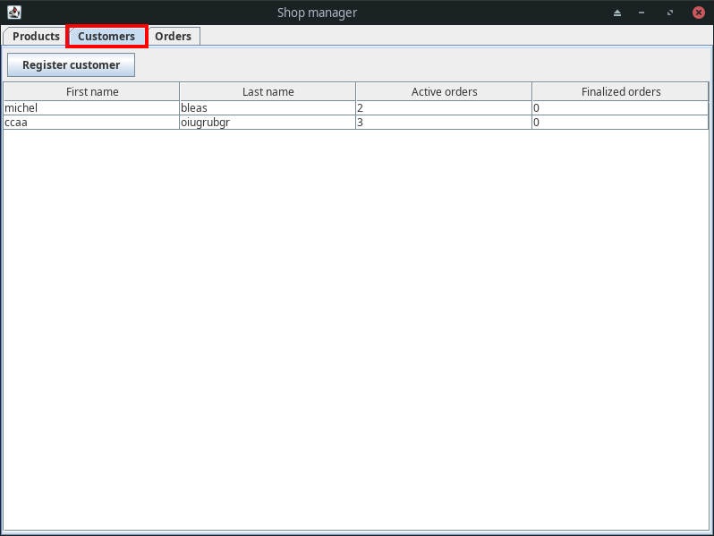
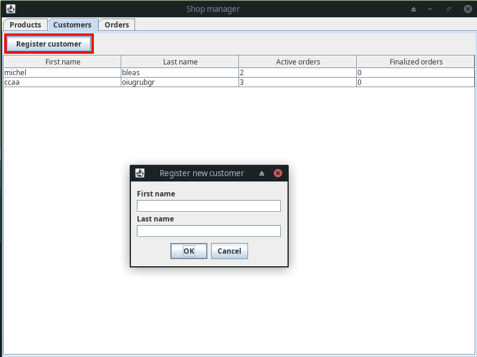
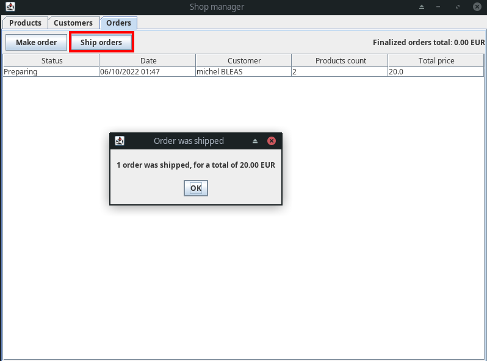
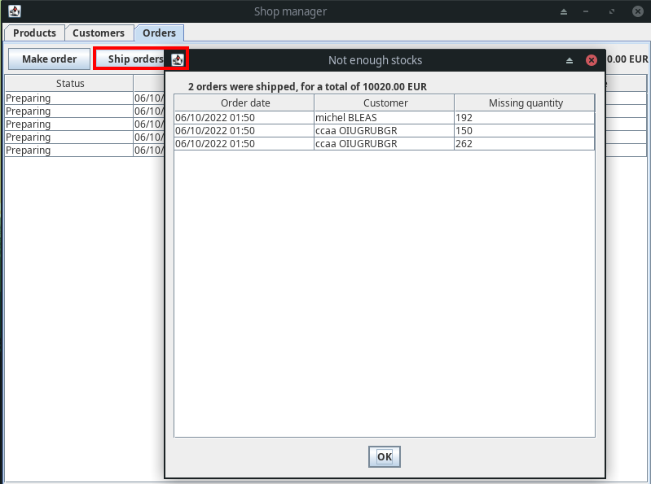
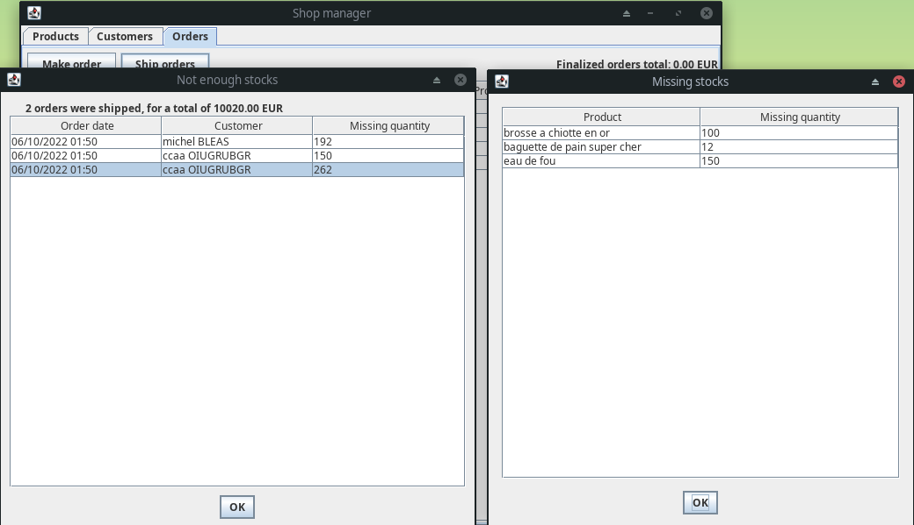

# Shop Manager : User Guide

## Features

- [See all stocks](#see-stocks)
- [Create new product](#create-product)
- [See all customers](#see-customers)
- [Register new customer](#register-customer)
- [See all orders](#see-orders)
- [See total of finalized orders](#see-total)
- [Make an order](#make-an-order)
- [Edit an order](#edit-an-order)
- [Ship orders](#ship-orders)

## See stocks

You can visualize your stocks with the first tab. You'll have access to a read only sortable table containing all your products. With a column for their name, price per unit and available quantity  

## Create product

You can create a new product while being on the first tab. Just hit "New product" and you'll see a popup asking you different informations about your new product.  
When you've done filling the form, just click "Ok" and the product is going to be added to the table and available for orders.  
You can also click "Cancel" to abort the process  

## See all customers

You can visualize your customers with the second tab. You'll have access to a read only sortable table containing all your customers. With a column for their first and last name, active and finalized orders count  

## Register customer

You can register a new customer by cliking "Register customer" in the customer tab. You'll see a popup asking you different informations about your new customer.  
When you've done filling the form, just click "Ok" and the customer is going to be added to the table and available for taking orders.  
You can also click "Cancel" to abort the process  

## See orders

You can visualize your orders with the third tab. You'll have access to a read only sortable table containing all your active and finalized orders. With a column for their status, date, customer name, product count and total price  

## See total

You can see the total price of all finalized order in the top right section of the interface

## Make an order

You can make a new order by clicking the "Make order" button. You'll see a popup asking you informations about the order. You can select the customer (in green), and add a new product (in yellow)

  

If you arent happy with the quantity of the product you just created, you can double click it and you'll have a prompt allowing you to modify this quantity.  

## Edit an order

Once you have your orders, you can edit them with a double click in the table. You'll be able to visualize any order but only edit non-finalized onces.  

## Ship orders

When you've done making your orders, you can ship them by clicking on the "Ship orders button"  

It's going to try to ship all orders. If you have enough stocks for all orders in preparing state, you'll have a popup give the total price of shipped orders.

  

On the other hand, if you don't have enough stocks, you'll have a list of commands with errors:  

  

You can then double click on any row to get more detailled informations:  

  
