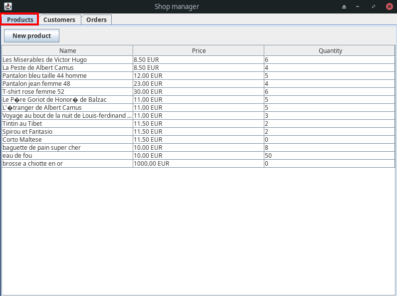

# Shop Manager : User Guide

## Features

- [See all stocks](#see-stocks)
- [Create new product](#create-product)
- [See all clients](#see-clients)
- [Register new client](#register-client)
- [See all orders](#see-orders)
- [See total of finalized orders](#see-total)
- [Make an order](#make-an-order)

## See stocks

You can visualize your stocks with the first tab. You'll have access to a read only sortable table containing all your products. With a column for their name, price per unit and available quantity  

## Create product

You can create a new product while being on the first tab. Just hit "New product" and you'll see a popup asking you different informations about your new product.  
When you've done filling the form, just click "Ok" and the product is going to be added to the table and available for orders.  
You can also click "Cancel" to abort the process  

## See all clients

You can visualize your clients with the second tab. You'll have access to a read only sortable table containing all your clients. With a column for their first and last name, active and finalized orders count  

## Register client

You can register a new client by cliking "Register client" in the client tab. You'll see a popup asking you different informations about your new client.  
When you've done filling the form, just click "Ok" and the client is going to be added to the table and available for taking orders.  
You can also click "Cancel" to abort the process  

## See orders

You can visualize your orders with the third tab. You'll have access to a read only sortable table containing all your active and finalized orders. With a column for their status, date, client name, product count and total price  

## See total

You can see the total price of all finalized order in the top right section of the interface

## Make an order

You can make a new order by clicking the "Make order" button. You'll see a popup asking you informations about the order. You can select the client (in green), and add a new product (in yellow)

  

If you arent happy with the quantity of the product you just created, you can double click it and you'll have a prompt allowing you to modify this quantity.  

## Edit an order

Once you have your orders, you can edit them with a double click in the table. You'll be able to visualize any order but only edit non-finalized onces.  

## Ship orders

When you've done making your orders, you can ship them by clicking on the "Ship orders button"  

It's going to try to ship all orders. If for an order there aren't enough stocks, it's going to be printed in the console (we don't have an interface for that *yet*)